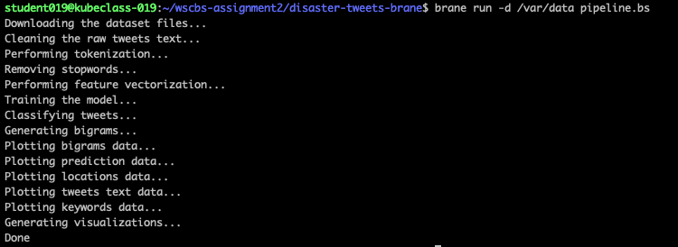

# Natural Language Processing with Disaster Tweets

[](https://zenodo.org/badge/latestdoi/491528415)


## Introduction

This project features an implementation of an NLP pipeline for [the disaster tweets Kaggle competition](https://www.kaggle.com/competitions/nlp-getting-started/overview/description) using the [Brane](https://github.com/epi-project/brane) framework. The implementation is divided into the following Brane packages which can be imported individually and used in other workflows: `compute` and `visualization`.

- `compute` exposes utilities for preprocessing data, training a classifier, and generating a valid submission file for the challenge.
- `visualization` provides functions to generate plots and charts based on the dataset.

We also include a `github.yml` specification which defines an OpenAPI container that exposes a function to download arbitrary files from GitHub repositories.

## Build

Each package can be individually imported with the following command:

```bash
brane import marinoandrea/disaster-tweets-brane -c packages/<PACKAGE_NAME>
```

However, we also provide a shell script for convenience. The user can clone the repository and simply run `./build.sh all` to build all of our packages. Additionally, you also can run the following commands to build a specific package.

```bash
# build the computation package
./build.sh compute
# build the visualization package
./build.sh visualization
```

Of course, you can always navigate to the package directory and run the following command to build the brane package.

```
brane build container.yml
```

## Run

Our pipeline implementation can be executed locally by simply running the following command in the root folder of the project:

```bash
brane run pipeline.bs
```
The following picture shows an example that our package uses the pipeline.bs to run the whole pipeline in the Kubernetes cluster.
  
